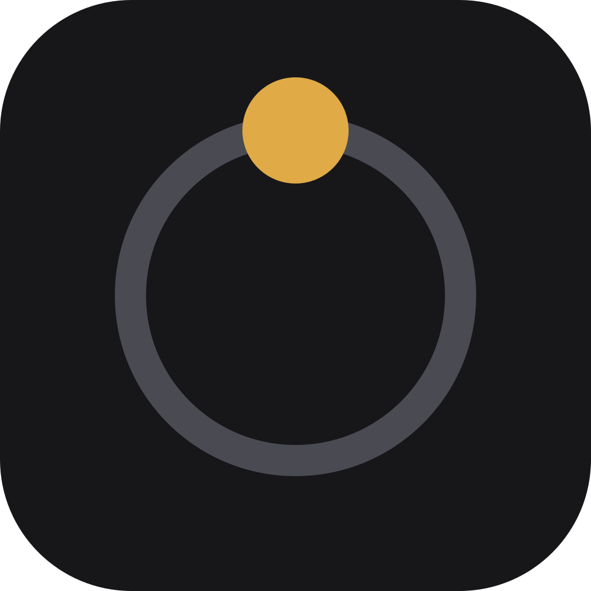

<p align="center">
  
</p>

<h1 align="center">Agent Wheel</h1>

<p align="center"><strong>One vertical, full-circle system.</strong></p>

Agent Wheel takes a project from a two-field Idea to a shipped, proven
artifact through a fixed spine of gated nodes, and runs a full control wheel
at every lifecycle arrow and before every outbound seat message. The law of
the system is [`Agent-Wheel-ascii-diagram.txt`](Agent-Wheel-ascii-diagram.txt)
at the repository root (its header names the current revision): when code,
README, packaging, or any other document disagrees with it, the law wins. Read order:
the law, then [`build docs/00-READ-ORDER.md`](build%20docs/00-READ-ORDER.md);
nothing else is normative.

```text
Idea → Experience → Design → Spec → Plan (tried read-only, then executed leaf by leaf on branches) → Done
         with THE WHEEL running at every arrow and before every outbound message:
OPEN → STAGING (Look 1) → STATE WATCHER → DROP-DOWN → FRONTIER → DOUBLE-LOOK CONTEXT (Look 2)
     → EGRESS GUARD → CLOSED_RUNNING → REVIEWING → APPLYING → REBUILD / NEXT
```

Five nodes and one state. Done is the project turning purple after the final
closure, never a node; the approach is the alternative a Plan decision leaf
chose, never a node; work is the Plan's leaves executed on branches and merged
to main, never a node.

## The product

- **One installed `Agent Wheel.app`.** AppKit: one menu bar status item, one
  window holding one WKWebView that loads bundled HTML only. Its navigation
  delegate refuses every URL that is not the bundle or the tokened loopback
  API. There is no external browser and no dev-server UI anywhere in the
  product.
- **The helper is a child process.** The app starts the bundled Node.js 26
  helper, writes the per-launch token to its stdin (never argv, env, or
  disk), restarts it if it dies, shows `RECOVERY_REQUIRED_V1` when it does,
  and stops it on Quit. The helper binds only `127.0.0.1`; a request without
  the token is 401 and audited.
- **Keychain stays in the shell.** Provider API keys are read and written by
  the Swift shell through Security.framework and handed to the helper in
  memory over the tokened loopback. The helper never persists a secret.
- **Signing.** Ad-hoc (`codesign -s -`), not notarized. Because the ad-hoc
  identity changes with every build, Accessibility and Keychain access
  re-prompt after each rebuild. Developer ID + notarization is a named
  post-2.0 item.

## What makes it a wheel

- **Schema storage, not Markdown.** Every canonical node body is strict
  JSON validated by the in-tree JSON Schema 2020-12 subset validator with
  `additionalProperties: false`; unknown fields are refused at the Form
  Service before commit. Accepted versions are immutable.
- **The Idea root has exactly two fields**, `problem` and `solution`. Six
  transient chips help fill them; chips are prompts, not fields.
- **One canonical writer.** The Commit Coordinator alone appends events and
  replaces snapshots atomically. Old or new complete state only, never
  partial. A stale lock is never cleared by code, only by the human's gate
  action.
- **A fresh turn must accept.** The turn that stages a result can never
  accept it; review independence is recorded on a ladder (a different
  route, or the same route in a fresh context with no author reasoning).
- **Design is intent, not architecture.** Screens, layout and visual system,
  states and transitions, interaction rules, content rules, and acceptance
  criteria, every one a claim with a stable id, authored by the human or
  proposed by the Leader seat and approved at `DESIGN_READY`. How to build
  it is decided inside the Plan's decision leaves.
- **The living plan.** The Plan is generated from the exact accepted Idea,
  Experience, Design, and Spec; every leaf carries `claim_refs`. Every
  required leaf is tried read-only in app-managed scratch outside the repo,
  with recorded evidence and its executor; the deterministic plan closure
  proof then maps every claim to a passed leaf before anything executes.
  The Builder then executes one leaf or one `after[]` group per dispatch on
  an isolated branch, the engine builds and tests it there, and the
  Reviewer's accept merges the branch to main and marks the leaves done. A
  leaf is `untried | passed | gap | conflict | executing | done | stale`.
- **Fixed catalogs.** Prefixes, human-facing texts, and the gate catalog are
  versioned JSON; the model can neither invent nor bypass a gate action.
  Reject injects the exact prefix `rejected, optimize`.
- **Budget authority.** `{25, 50, unlimited}` dispatches per sliding window
  of `{5 hours, 1 day, 1 week, 1 month}`, default 25; exhaustion is a
  yellow gate.
- **Project agent controls.** Choose the Leader, Builder, and Reviewer’s
  provider, model, and reasoning in each project’s Inspector (default routes:
  `grok:cli`, `grok:cli`, `chatgpt:codex`). Budget belongs there too. These
  settings never change the product Spec or invalidate its claims. Only
  registered, ready routes can send messages.
- **Traversal both ways.** Failures fail up to the earliest responsible
  ancestor; a new accepted version drops down by claim: only the leaves that
  serve a changed or removed claim, and what needs them, go back to untried.
- **Outcomes, not results.** Every back card carries exactly one outcome:
  `result | malformed | transport_error | timeout | refused`. Transport
  failures never enter schema validation.
- **Done must prove itself.** Purple requires every required leaf done on
  main, a built, tested artifact with a resolvable primary URI and an
  integrity hash, and the final read-only closure walked by the engine and
  reviewed by the Reviewer: Artifact → Plan → Spec → Design → Experience →
  Idea.solution, bidirectional at the root.

## Requirements

- **From the DMG:** macOS 13 or newer on Apple silicon. Intel Macs are not supported. The
  app is self-contained: an arm64 Node.js 26 runtime ships inside the
  bundle, so nothing needs to be installed.
- **From source:** Node.js 22 or newer for the engine, schemas, storage, and
  transport tests (they pass on Node 22 and Node 26); macOS with the Xcode
  Command Line Tools to build the shell.

## Using it

Open `Agent Wheel.app`. The window shows the project rail with **New
Project** and one row per project, the status / stage / budget header, the
current node expanded, an optional inspector (the seat assignment, the budget
window and count, route health, API keys under Advanced), and the fixed
composer at the bottom. New Project names the project and opens the Idea
form; the composer's `/spool` does the same:

```text
/spool My Project | what is failing, for whom, and in what situation | the observable success state
```

The composer's `/spool` is carried by `spool_project`, the system's only MCP
tool; the helper runs the stdio MCP server as its own child. Every other rule
is internal system enforcement.

Experience, Design, and Spec are entered in the strict form editor under the
expanded node: a schema-shaped JSON body that the Form Service validates
before commit (an unknown field is refused); Design can also be proposed by
the Leader seat on request. Gate decisions are the fixed buttons the catalog
allows; the Plan, its trial, the closure proof, the executions on branches,
the reviews, and the final closure are the wheel's own moves. The Plan node
shows every leaf with its state as the artifact grows on main.

The window opens across the full usable desktop, keeping the menu bar and Dock
available. It remains a normal resizable window. Opening it again expands it
to the current display, including after an older build saved a smaller size.

Closing the window keeps Agent Wheel in the menu bar. Choose **Quit Agent
Wheel** from the menu bar item to stop it and its helper.

Local state lives in `~/Library/Application Support/Agent Wheel`
(`store/projects/<uuidv7>/` is canonical per project, `.convobus` is the
private transport store). A store an earlier Agent Wheel wrote is never
read: on first launch it is archived beside itself.

## CLI

```text
agentwheel helper   # the app's child: engine + store + watcher + tokened loopback API
agentwheel mcp      # stdio MCP server exposing only spool_project (port + token on fd 3)
agentwheel status   # one status line from the canonical store
agentwheel stop     # stop the live helper (verified by its command line)
agentwheel reset    # archive the store for a fresh circle (never deletes)
```

## Tests

```bash
cd agentwheel && node scripts/test-runtimes.js
```

The runner names every test file in one of five groups (engine, schemas,
storage, transport, gui), runs `node --test` over them, and checks in code
that the package has zero runtime npm dependencies. On Node 22 and Node 26
the engine, schemas, storage, and transport groups pass on macOS and on Linux;
the GUI group belongs to the macOS shell and is excluded by name off macOS
(`--no-gui` does the same anywhere), printed as an exclusion, never skipped
silently. `npm test` still runs every file directly.

## Packaging (macOS)

```bash
cd agentwheel
./scripts/package-release.sh --snapshot
```

Builds the current public source allowlist in a fresh, neutral repository,
runs the tests, and produces the five release assets in `release/`:
the arm64 DMG, source ZIP, checksums, release notes, and manifest. The
manifest records the public snapshot’s tag and commit, versions, hashes,
and build time. The working repository and its history are unchanged.

`scripts/verify-release.sh` checks the extracted artifacts, hashes,
architectures, versions, source allowlist, ad-hoc signing, and privacy
patterns. See [RELEASING.md](RELEASING.md) for publishing instructions.

## License

[Apache-2.0](LICENSE). ConvoBus 0.2.0 is vendored under `Convobus/` under
its own Apache-2.0 license; the app packages only its CORE MANIFEST files
and the full licensed source ships in the source release. See
[THIRD_PARTY_NOTICES.md](THIRD_PARTY_NOTICES.md).
